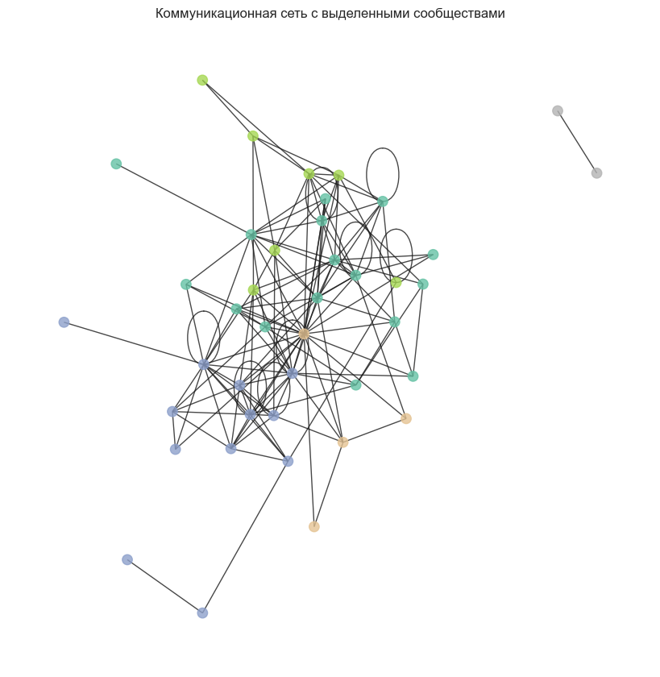
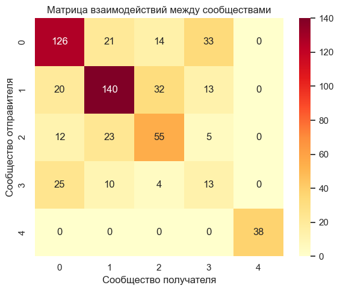
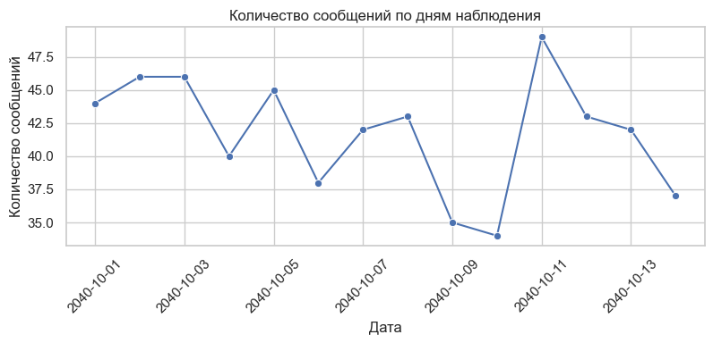
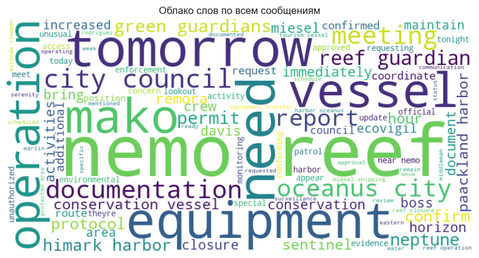

# Communication Network Analysis

This project explores the structure and dynamics of a communication network represented as a directed graph.

The dataset reflects message exchanges between participants involved in maritime operations, including vessel coordination, administrative procedures, monitoring activities and organizational communication.

The goal of the analysis is to understand how the network is structured, identify key actors, detect communities and explore the thematic content of messages.

---

## Project Objectives

- Transform graph-based data into a flat analytical structure
- Perform temporal analysis of communication activity
- Identify central and influential participants
- Detect structural communities within the network
- Analyze inter-cluster communication patterns
- Explore thematic patterns in message content
- Compare different graph layouts for network visualization
- Examine communication patterns across weekdays and weekends

---

## Methodology

The analysis includes:

- Data preprocessing and graph transformation
- Time-based activity analysis (hourly patterns and weekday vs weekend comparison)
- Degree and betweenness centrality metrics
- Community detection using modularity optimization
- Inter-cluster interaction analysis
- Text mining and word frequency analysis
- Word cloud comparison across communities
- Network visualization using multiple graph layouts

Python libraries used:

- pandas
- seaborn
- matplotlib
- networkx
- wordcloud
- scikit-learn

---

## Key Findings

- The network exhibits a moderately centralized structure with a dense communication core
- Several highly connected participants dominate the network structure
- Multiple stable communities were detected within the network
- Communication occurs predominantly within communities rather than between them
- Certain participants act as bridges connecting different clusters
- Communication activity is concentrated during working hours and weekdays
- Message content is largely operational and coordination-focused
- Different communities show thematic specialization in communication topics

---

## Visualizations

The project includes:

- Temporal activity plots
- Sender and receiver activity rankings
- Network graph visualization
- Community detection visualization
- Inter-cluster heatmap
- Word clouds and content analysis plots

### Community Detection

### Inter-Cluster Communication

### Temporal Activity

### Word Cloud

---

## How to Run

1. Clone the repository
2. Install required dependencies
3. Open the notebook `network_analysis.ipynb`
4. Run all cells sequentially

---

## Author Rymar Mariia

Student project – network analysis and data visualization
