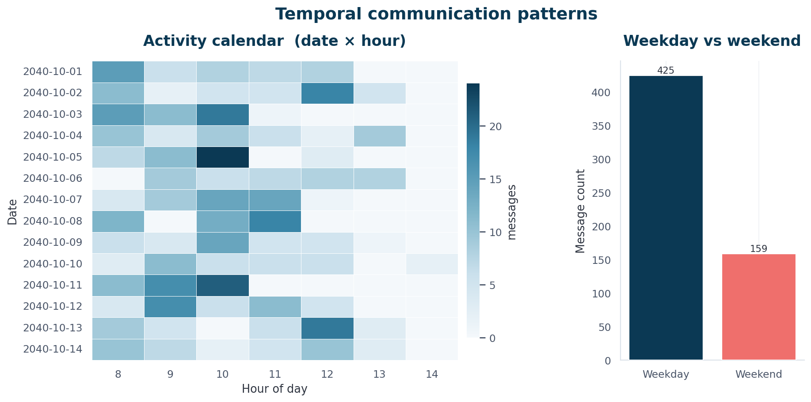
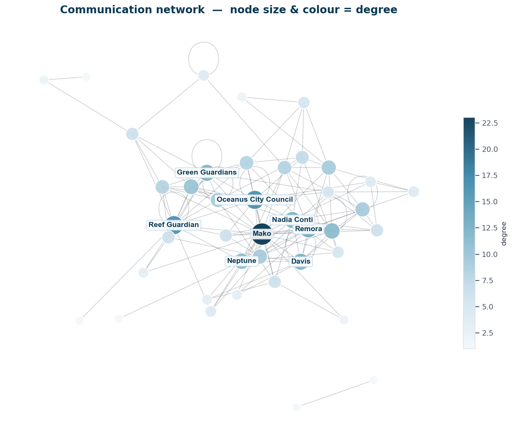
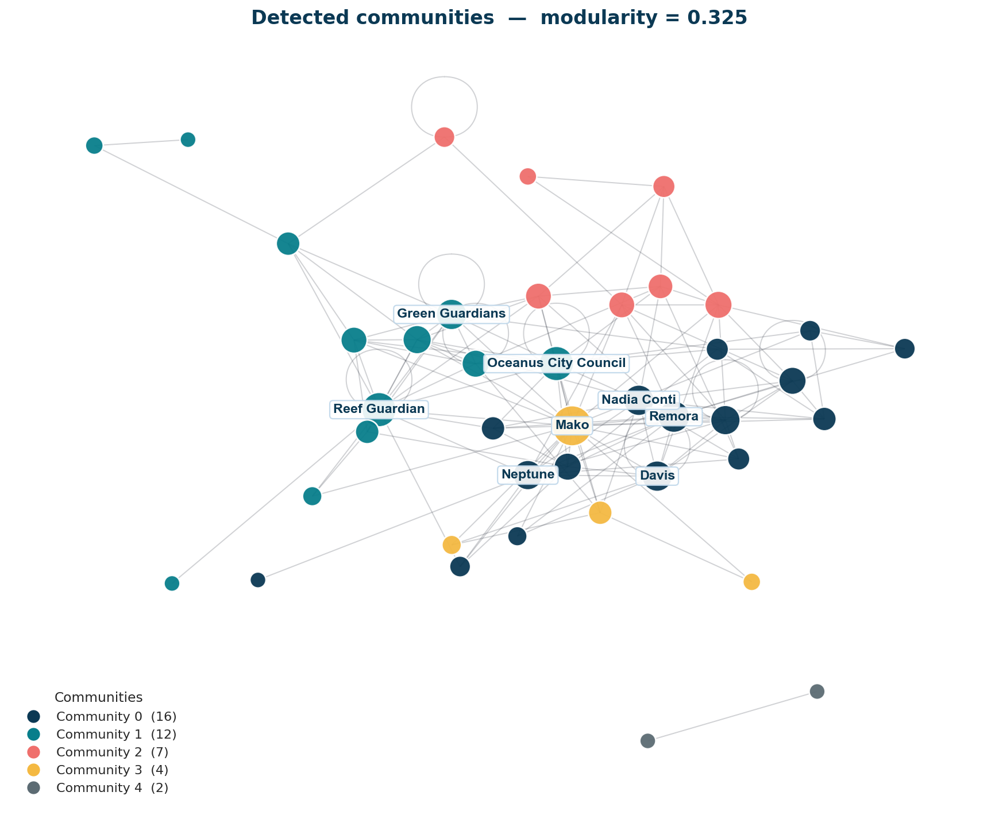
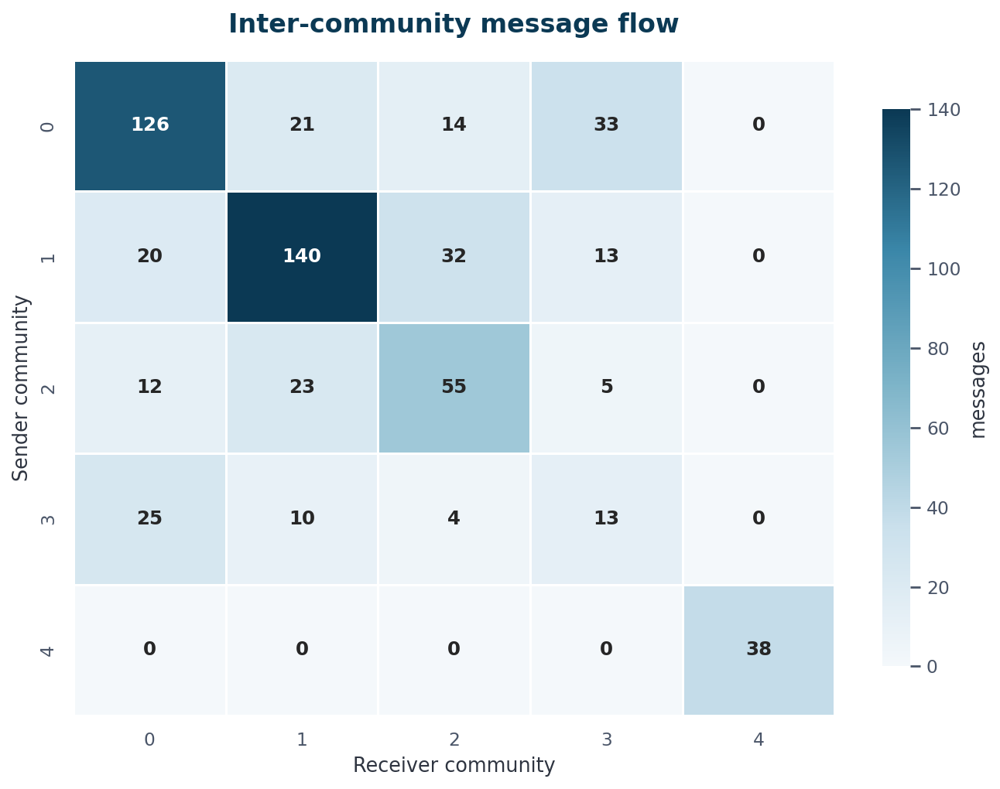
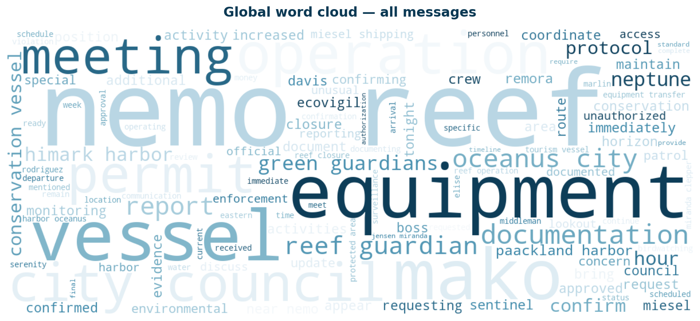

# Communication Network Analysis

**A structural and thematic study of a directed communication graph.**

This project reconstructs a real-world–style communication network from a
graph-formatted dataset and studies **who talks to whom, when, and about what**.
The network describes message exchanges between participants involved in maritime
operations — vessel coordination, permits, environmental monitoring and
inter-agency interactions.

The goal is to combine four complementary lenses — **temporal**, **structural**,
**community**, and **thematic** — and to test a concrete set of hypotheses about
the organization of information flow inside the system.

---

## Dataset

The source file is a single JSON document describing a directed graph:

- **1,159 nodes** — individuals, organizations, vessels, locations, and analytical
  events (monitoring, assessments, vessel movements, …).
- **3,226 edges** typed as `sent`, `received`, `evidence_for`, and a few others.
- A distinguished **`Communication`** node type that carries the actual message
  text and timestamp.

Every message in the analysis is reconstructed by joining the `sent` and
`received` edges through their shared `Communication` node. This yields a tidy
**message table** (sender, receiver, timestamp, content) with **584 messages**
spanning a two-week window in October 2040.

All raw data lives in [data/](data/).

---

## Research hypotheses

| # | Hypothesis |
|---|-----------|
| **H1** | The network has a pronounced central core with a few dominant participants. |
| **H2** | The network fragments into stable communities dominated by intra-group traffic. |
| **H3** | Key brokers bridge different clusters and sustain inter-group communication. |
| **H4** | Message topics differ between the largest communities, reflecting a functional specialization. |

All four are tested quantitatively in the notebook. A summary of the outcomes is at
the bottom of this README.

---

## Methodology

1. **Graph → tidy table.** Flatten the JSON graph into a relational `messages`
   DataFrame, recovering the sender/receiver pair for every `Communication` event.
2. **Temporal analysis.** Hourly distributions, daily volumes, a date × hour
   activity calendar, and a weekday vs. weekend comparison.
3. **Participant analysis.** Top senders/receivers, engagement totals, and
   directional balance (net sender vs. net receiver).
4. **Network analysis.** Directed graph construction with `networkx`; degree and
   betweenness centrality; alternative layouts (spring, Kamada–Kawai, circular).
5. **Community detection.** Greedy modularity optimization (Clauset–Newman–Moore)
   with the modularity score reported.
6. **Inter-community flow.** Sender-community × receiver-community traffic
   matrix, separating intra- and inter-cluster communication.
7. **Content analysis.** Tokenization, stop-word filtering, global word frequency
   ranking, a global word cloud, and per-community word clouds for topical
   comparison.

---

## Tech stack

- **Python 3.9+**
- `pandas`, `numpy` — data wrangling
- `networkx` — graph construction and centrality / community algorithms
- `matplotlib`, `seaborn` — plotting, with a custom unified theme
- `wordcloud` — text visualization
- `scikit-learn` — English stop-word list

All dependencies are pinned in [requirements.txt](requirements.txt).

---

## Repository layout

```
.
├── README.md                   ← you are here
├── network_analysis.ipynb      ← the full analysis, English, executed
├── build_notebook.py           ← script that (re)builds the notebook
├── requirements.txt
├── data/
│   ├── MC3_graph.json          ← the input graph
│   ├── MC3_schema.json
│   └── MC3_data_description.pdf
└── images/                     ← figures rendered by the notebook
    ├── temporal_activity.png
    ├── network_analysis.png
    ├── communities.png
    ├── intercluster_heatmap.png
    └── wordcloud.png
```

---

## How to run

```bash
# 1. create and activate a virtual environment
python3 -m venv .venv
source .venv/bin/activate

# 2. install dependencies
pip install -r requirements.txt

# 3. execute the notebook
jupyter notebook network_analysis.ipynb
#   — or, headless, to refresh all outputs & figures:
jupyter nbconvert --to notebook --execute --inplace network_analysis.ipynb
```

The notebook is self-contained: running it regenerates every chart in `images/`.

---

## Visual highlights

### Temporal communication patterns
Messaging is concentrated in the morning (peak around 10:00) and drops sharply on
weekends — a strong signal of planned, operational communication.



### Network topology
A dense central core surrounded by a sparser periphery. Node size and colour
encode degree.



### Detected communities
Greedy modularity optimization recovers five communities; the two largest form
the operational core of the graph.



### Inter-community flow
The diagonal dominates: most traffic stays within a community. Community 4 is
fully isolated (no messages in or out).



### Global vocabulary
The conversation is overwhelmingly operational: *equipment, vessel, reef, meeting,
permit, documentation, oceanus city, green guardians*.



---

## Key findings

- **H1 — Central core. Confirmed.** Both degree and betweenness centrality
  converge on the same small set of dominant actors (**Mako**, **Reef Guardian**,
  **Oceanus City Council**), and every layout places them at the centre of a
  dense core.
- **H2 — Modular structure. Confirmed.** Five communities are detected with a
  modularity score above the 0.3 Clauset–Newman threshold; intra-community
  traffic dominates the interaction matrix.
- **H3 — Bridges. Confirmed.** Betweenness centrality surfaces actors (**Mako**,
  **Mrs. Money**, **Reef Guardian**, **Boss**) whose position on shortest paths
  sustains the thin but real inter-cluster flow.
- **H4 — Thematic specialization. Confirmed.** Per-community word frequencies
  yield distinct vocabularies — operational logistics on one side, environmental
  and administrative oversight on the other.
- **Behavioural signature.** The network behaves like a real operational
  organization: structured, schedule-driven, modular, with a clear division of
  labour that shows up both in *who talks to whom* and in *what they talk about*.

---

## Author

**Mariia Rymar** — network analysis and data-visualization project.
